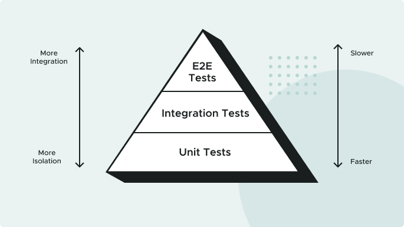
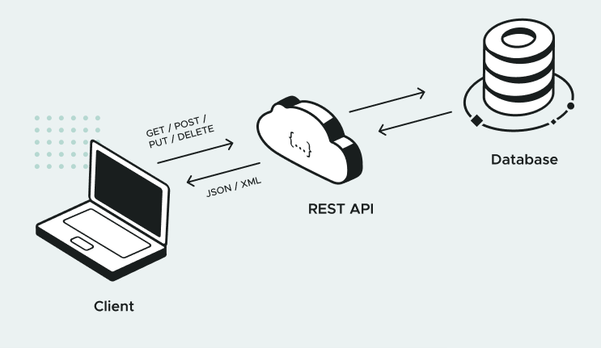
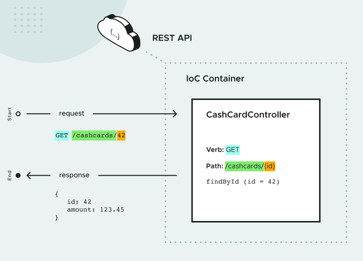

# API Contracts

The software industry has adopted several patterns for capturing agreed upon API behavior in documentation and code. These agreements are often called "contracts". Two examples include Consumer Driven Contracts and Provider Driven Contracts. We'll provide resources for these patterns, but won't discuss them in detail in this course. Instead, we'll discuss a lightweight concept called API contracts.

We define an API contract as a formal agreement between a software provider and a consumer that abstractly communicates how to interact with each other. This contract defines how API providers and consumers interact, what data exchanges looks like, and how to communicate success and failure cases.

The provider and consumers do not have to share the same programming language, only the same API contracts. For the Family Cash Card domain, let’s assume that currently there's one contract between the Cash Card service and all services using it. Below is an example of that first API contract. Don't worry if you don't understand the entire contract. We'll address every aspect of the information below as you complete this course.

```js

Request
  URI: /cashcards/{id}
  HTTP Verb: GET
  Body: None

Response:
  HTTP Status:
    200 OK if the user is authorized and the Cash Card was successfully retrieved
    401 UNAUTHORIZED if the user is unauthenticated or unauthorized
    404 NOT FOUND if the user is authenticated and authorized but the Cash Card cannot be found

  Response Body Type: JSON

  Example Response Body:
    {
      "id": 99,
      "amount": 123.45
    }

```

## What Is JSON?

JSON (Javascript Object Notation) provides a data interchange format that represents the particular information of an object in a format that you can easily read and understand.

Example:

```json

{
  "id": 99,
  "amount": 123.45
}

```

# Testing First

## What Is Test Driven Development?

It’s common for software development teams to author automated test suites to guard against regressions. Often these tests are written after the application feature code is authored. We'll take an alternative approach: we'll write tests before implementing the application code. This is called test driven development (TDD).

Why apply TDD? By asserting expected behavior before implementing the desired functionality, we’re designing the system based on what we want it to do, rather than what the system already does.

Another benefit of “test-driving” the application code is that the tests guide you to write the minimum code needed to satisfy the implementation. When the tests pass, you have a working implementation (the application code), and a guard against introducing errors in the future (the tests).


## The Testing Pyramid

Different tests can be written at different levels of the system. At each level, there is a balance between the speed of execution, the “cost” to maintain the test, and the confidence it brings to system correctness. This hierarchy is often represented as a “testing pyramid”.



*Unit Tests:* 
  A Unit Test exercises a small “unit” of the system that's isolated from the rest of the system. They should be simple and speedy. You want a high ratio of Unit Tests in your testing pyramid, as they’re key to designing highly cohesive, loosely coupled software.

*Integration Tests:*
  Integration Tests exercise a subset of the system and may exercise groups of units in one test. They are more complicated to write and maintain, and run slower than unit tests.

*End-to-End Tests:* 
  An End-to-End Test exercises the system using the same interface that a user would, such as a web browser. While extremely thorough, End-to-End Tests can be very slow and fragile because they use simulated user interactions in potentially complicated UIs. Implement the smallest number of these tests.

## The Red, Green, Refactor Loop

Software development teams love to move fast. So how do you go fast forever? By continuously improving and simplifying your code–refactoring. One of the only ways you can safely refactor is when you have a trustworthy test suite. Thus, the best time to refactor the code you're currently focusing on is during the TDD cycle. This is called the Red, Green, Refactor development loop:

*Red:* 
  Write a failing test for the desired functionality.

*Green:* 
  Implement the simplest thing that can work to make the test pass.

*Refactor:* 
  Look for opportunities to simplify, reduce duplication, or otherwise improve the code without changing any behavior—to refactor.

*Repeat!*


# Implementing GET

you’ll learn what REST is, and how to use Spring Boot to implement a single RESTful endpoint.

## REST, CRUD, and HTTP

Let’s start with a concise definition of *REST*:

*Representational State Transfer*. In a RESTful system, *data objects are called Resource Representations*. The purpose of a RESTful API (Application Programming Interface) is to manage the state of these Resources.

Said another way, you can think of “state” being “value” and “Resource Representation” being an “object” or "thing". Therefore, REST is just a way to manage the values of things.

Those things might be accessed via an API, and are often stored in a persistent data store, such as a database.



CRUD stands for “Create, Read, Update, and Delete”. These are the four basic operations that can be performed on objects in a data store. We’ll learn that REST has specific guidelines for implementing each one.

Another common concept associated with REST is the Hypertext Transfer Protocol. In HTTP, a caller sends a Request to a URI. A web server receives the request, and routes it to a request handler. The handler creates a Response, which is then sent back to the caller.

> A URI (Uniform Resource Identifier) is a string of characters used to identify a resource on the internet. It's a generic term that includes both URLs (Uniform Resource Locators) and URNs (Uniform Resource Names).


The components of the Request and Response are:

Request

  > Method (also called Verb, POST, GET, PUT, DELETE)
  > URI (also called Endpoint)
  > Body (RequestBody, in JSON form, converted upon receival)

Response

  > Status Code
  > Body

The power of REST lies in the way it references a Resource, and what the Request and Response look like for each CRUD operation.

For CREATE: use HTTP method POST.
For READ: use HTTP method GET.
For UPDATE: use HTTP method PUT.
For DELETE: use HTTP method DELETE.

The endpoint URI for Cash Card objects begins with the /cashcards keyword. READ, UPDATE, and DELETE operations require we provide the unique identifier of the target resource. 

The application needs this unique identifier in order to perform the correct action on exactly the correct resource. For example, to READ, UPDATE, or DELETE a Cash Card with the identifier of "42", the endpoint would be 

/cashcards/42.

Notice that we do not provide a unique identifier for the CREATE operation. No identifier should be provided when creating a new Cash Card because the application will create a new unique identifier for us.

The chart below has more details about RESTful CRUD operations.

| Operation | API Endpoint       | HTTP Method | Response Status  |
|-----------|--------------------|-------------|------------------|
| Create    | /cashcards         | POST        | 201 (CREATED)    |
| Read      | /cashcards/{id}    | GET         | 200 (OK)         |
| Update    | /cashcards/{id}    | PUT         | 204 (NO CONTENT) |
| Delete    | /cashcards/{id}    | DELETE      | 204 (NO CONTENT) |

## The Request Body

When following REST conventions to create or update a resource, we need to submit data to the API. This is often referred to as the request body. 

The CREATE and UPDATE operations require that a request body contain the data needed to properly create or update the resource. 

For example, a new Cash Card might have a beginning cash value amount, and an UPDATE operation might change that amount.

## Read Example

Let’s use the example of a Read endpoint. For the Read operation, the URI (endpoint) path is 

/cashcards/{id}

, where {id} is replaced by an actual Cash Card identifier, without the curly braces, and the HTTP method is GET.

In GET requests, the body is empty. So, the request to read the Cash Card with an id of 123 would be:

```js

Request:
  Method: GET
  URL: http://cashcard.example.com/cashcards/123
  Body: (empty)


```

The response to a successful Read request has a body containing the JSON representation of the requested Resource, with a Response Status Code of 200 (OK). Therefore, the response to the above Read request would look like this:

```js

Response:
  Status Code: 200
  Body:
  {
    "id": 123,
    "amount": 25.00
  }


```


# REST in Spring Boot

Now that we’ve discussed REST in general, let’s look at the parts of Spring Boot that we’ll use to implement REST. Let’s start by discussing Spring’s IoC container.

## Spring Annotations and Component Scan

One of the main things Spring does is to configure and instantiate objects. These objects are called Spring Beans, and are usually created by Spring (as opposed to using the Java new keyword). You can direct Spring to create Beans in several ways.

you’ll annotate a class with a Spring Annotation, which directs Spring to create an instance of the class during Spring’s Component Scan phase. This happens at application startup. The Bean is stored in Spring’s IoC container.

# Spring Web Controllers

In Spring Web, Requests are handled by Controllers. In this lesson, you’ll use the more specific *RestController:*

```java

  @RestController
  class CashCardController {
    
  }

```

That’s all it takes to tell Spring: “create a REST Controller”. The Controller gets injected into Spring Web, which routes API requests (handled by the Controller) to the correct method.



A Controller method can be designated a handler method, to be called when a request that the method knows how to handle (called a “matching request”) is received. Let’s write a Read request handler method! Here’s a start:

```java

// --- BACK-END Method

  private CashCard findById(Long requestedId) {
    //...
  }

// ---
```

Since REST says that Read endpoints should use the *HTTP GET method*, you need to tell Spring to route requests to the method only on *GET requests*. You can use *@GetMapping* annotation, which needs the URI Path:

```java

// --- Rest Controller Method

  @GetMapping("/cashcards/{requestedId}")
  private CashCard findById(/* missing an annotation here*/Long requestedId) {
    
  }

```

Spring needs to know how to get the value of the *requestedId* parameter. This is done using the *@PathVariable annotation*. The fact that the parameter name matches the *{requestedId}* text within the *@GetMapping parameter* allows Spring to assign (inject) the correct value to the requestedId variable:

```java

  @GetMapping("/cashcards/{requestedId}")
  public CashCard getCashCard(@PathVariable("requestedId") Long requestedId) {
      
      //...
  }


```

REST says that the Response needs to contain a Cash Card in its body, and a Response code of 200 (OK). 

Spring Web provides the ResponseEntity class for this purpose. It also provides several utility methods to produce Response Entities.

Here, you can use ResponseEntity to create a ResponseEntity with code 200 (OK), and a body containing a CashCard. The final implementation looks like this:

```java

  @Autowired
  private CashCardService cardServ;

  @GetMapping("/cashcards/{requestedId}")
  public CashCard getCashCard(
    @PathVariable("requestedId") Long requestedId
  ) {
    
    CashCard cashCard = cardServ.getCashCard(requestedId);
    
    if() {
      return ResponseEntity.ok(cashCard); //return requested data
    } else {
      return ResponseEntity
        .notFound() //return 404 not found
        .build();
    }
  }

```


